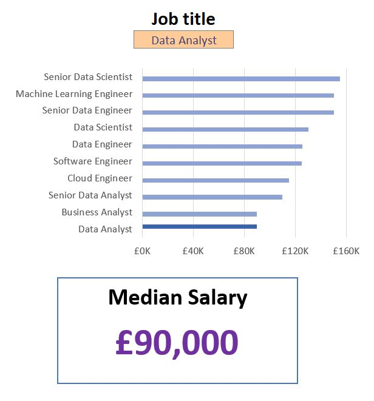

# Data Science Salary Dashboard (Excel)
<p align="center">
  
</p>

This dashboard was built to explore how data science salaries change by job title, country, and job type, and to practice structuring and visualising data in Excel. It provides an interactive way for job seekers to understand where roles are most common and how different positions compare salary-wise.

Find the final dashboard here: [Salary_Dashboard.xlsx](Salary_Dashboard.xlsx)

---

## Features

### Interactive Filters
- **Job Title** (9 options)
- **Country**
- **Job Type** (full time, part time, etc.)

All visuals and metrics update automatically when these are changed.

---

## Visualisations

### Job Title Salary Rank
Shows how the selected job title compares across all titles.


### Global Job Distribution Map
Displays which countries have the highest concentration of the selected job.


### Job Type Salary Rank
Shows salary differences within the selected job title based on job type.


### Summary Metrics
- Median salary  
- Top job platform  
- Job count  

---

## Dataset Overview
The dataset contains job titles, countries, schedule types, platforms, and salary information grouped into structured tables. It provides enough variation to compare salary trends across regions and job types.

---

## Excel Skills Used
- Charts (bar charts, map chart)
- Data Validation for dropdown filters
- Formulas for filtering and salary calculations

---

## Formulas and Functions
### Median Salary by Job Titles

```excel
=MEDIAN(
  IF(
    (jobs[job_title_short]=A2)*
    (jobs[salary_year_avg]<>0)*
    (jobs[job_country]=country)*
    (ISNUMBER(SEARCH(type,jobs[job_schedule_type]))),
    jobs[salary_year_avg]
  )
)
```
Uses IF() to filter rows that match the selected job title, country, job type, and exclude zero salaries. The filtered salaries are then passed to MEDIAN() to calculate the median for the selected criteria.

### Background Table


### Dashboard Implementation


## Conclusion
This dashboard provides a clear, interactive way to explore how data science salaries vary by job title, country, and job type. It combines Excel formulas, charts, and maps to deliver actionable insights for job seekers and highlights trends in the data science job market.


