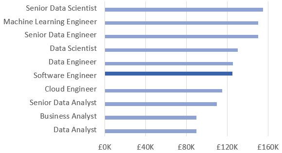
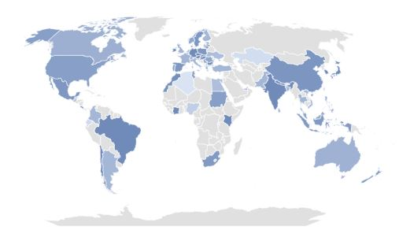
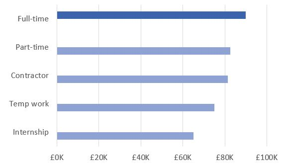

# Data Science Salary Dashboard (Excel)
This Excel dashboard lets users explore the data science job market using interactive filters and visualisations. It includes dropdown selections for job title, country, and job type, and presents insights such as salary comparisons, job distribution, and top job platforms.

---

## Features

### Interactive Filters
- **Job Title** (9 options)
- **Country**
- **Job Type** (full time, part time, etc.)

All graphs and metrics update dynamically based on these selections.

---

## Visualisations

### Job Title Salary Rank
Compare selected title against all others.

### Global Job Distribution Map
Shows where the selected job is concentrated across the world.  

### Job Type Salary Rank
Compare job types within the selected title.  

### Summary Metrics
- Median salary  
- Top job platform  
- Job count for current filter selection  

---

## Workbook Structure

The project uses separate sheets to keep data clean and modular:

- **Calculator** – main dashboard
- **Data_validation** – dropdown data / count metric
- **Title** – job titles / median salaries
- **Country** – country / salary data  
- **Type** – job schedule types / salary data
- **Salary** – median salary metric data
- **Platform** – job platform data  

---
